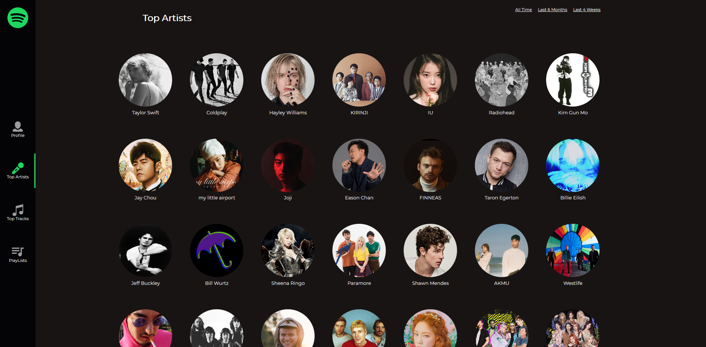

# Spotify-profile
Spotify-profile app allows you to login to your spotify cacount, view your favourite and most played tracks and artists based on your Spotify listening history. Discover song's audio feature and recommendations.

## The stack
- **Client side**: React, React router dom, styled-components, css3
- **Authentication**: Spotify token

## Live App
**View this appon [here](https://leoltl-spotify-profile.herokuapp.com)**

## Features
**As an unauthenticated user**:
- I can see login page which redirects me to spotify signin page to login with credentials

**As an authenticated user**:
- I can see my profile's details and listening history
- I can browse a song and view it's audio feature as categorized by Spotify and get recommended songs based on it
- I can browse an artist and see its top songs
